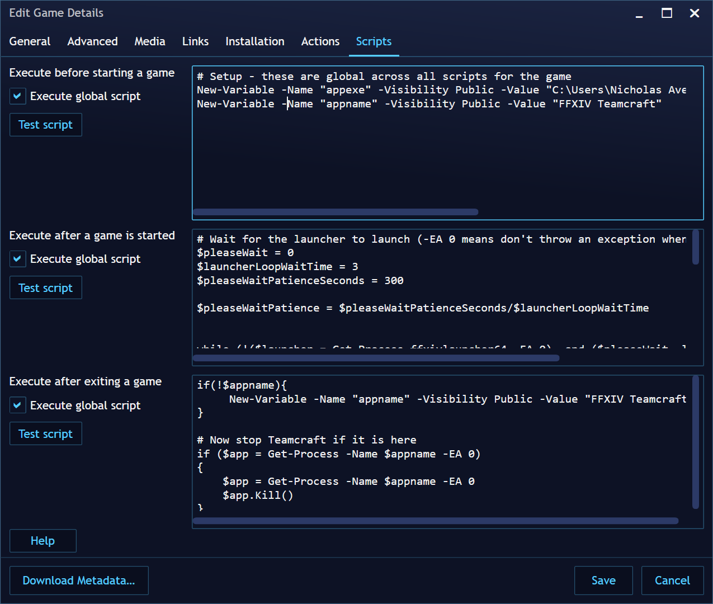

# FFXIV-TeamCraft Powershell Launch Scripts

This is a set of Powershell scripts to get [playnite](https://playnite.link/) to launch [FFXIV Teamcraft](https://ffxivteamcraft.com/) when FFXIV starts, and close it once it exits.

## Installation

Paste the contents of these PS files into the Action Scripts boxes in Playnite, like this:

