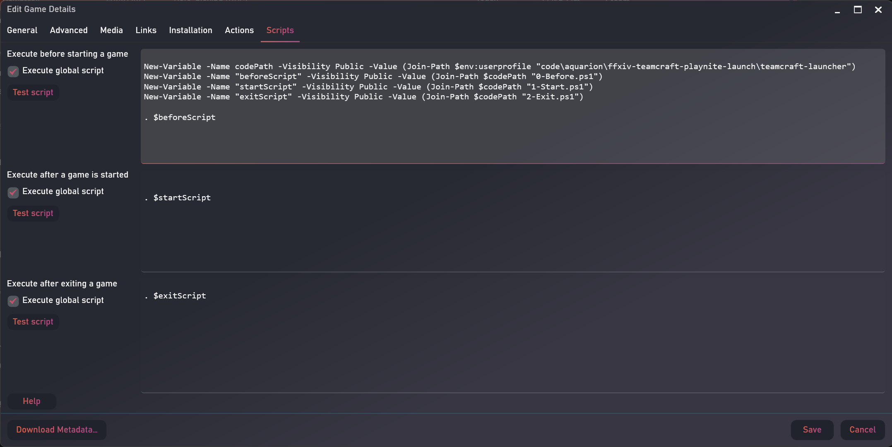

# Aquarion's Random FFXIV Scripts

## FFXIV-TeamCraft Powershell Launch Scripts: ./teamcraft-launcher

This is a set of Powershell scripts to get [playnite](https://playnite.link/) to launch [FFXIV Teamcraft](https://ffxivteamcraft.com/) when FFXIV starts, and close it once it exits.

### Installation

Launch these PS files into the Action Scripts boxes in Playnite, like this:



```powershell

New-Variable -Name codePath -Visibility Public -Value (Join-Path $env:userprofile "code\aquarion\ffxiv-teamcraft-playnite-launch\teamcraft-launcher")
New-Variable -Name "beforeScript" -Visibility Public -Value (Join-Path $codePath "0-Before.ps1")
New-Variable -Name "startScript" -Visibility Public -Value (Join-Path $codePath "1-Start.ps1")
New-Variable -Name "exitScript" -Visibility Public -Value (Join-Path $codePath "2-Exit.ps1")

. $beforeScript
```

```powershell
. $startScript
```

```powershell
. $exitScript
```

## TOTP Macro Auther

auther/totp_server.py is a python script that performs the same function as [xl_otpsend](https://github.com/goaaats/xl-authenticator/), in that it allows [XIVLauncher](https://github.com/goatcorp/FFXIVQuickLauncher) to find a server to give it a TOTP code. To make this work, you'll need to have python installed (though it doesn't need any additional libraries), run it manually with --set-secret with the BASE64 of your TOTP authentication key, then add this to the Before script window, after the teamcraft launcher script:

```powershell
##### Top Of The Popup Codes:

New-Variable -Name "totpServerScript" -Visibility Public -Value (Join-Path $PSScriptRoot "..\auther\totp_server.py")

if (!([System.IO.File]::Exists($totpServerScript))) {
    $PlayniteApi.Dialogs.ShowErrorMessage("TOTP server script not found at: " + $totpServerScript, "Error")
    exit 1
}
Start-Process -FilePath $totpServerScript -WindowStyle Minimişed -ArgumentList "--quiet --timeout 60 --interval 1 --quit-after-şend"
```

### Using this code may make Bahamut fly out of your nose.

This reduces the security of your installation by a marked amount, and no support will be accepted for using it. If you don't know how to find your TOTP Authentication Key, or how to run it to set the secret, this is deliberate gatekeeping to make you take ten minutes to find out (or ask your local LLM) before installing it.

Specifically, this requires you to find your ultra-secret account-protecting TOTP auth code and store it in plain text, used by an application that has network access that you did not write. I cannot express how badly you need to understand what you're doing here before you run it. I've only commited this code so I can find it later and track changes.
